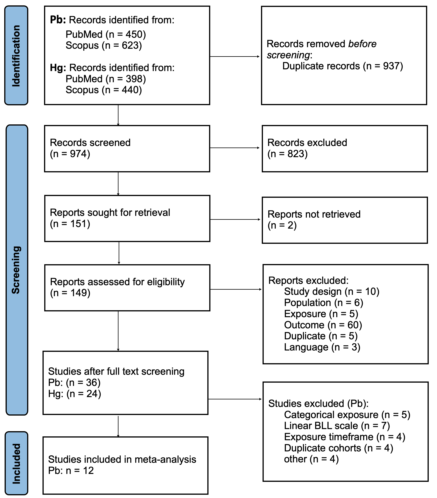
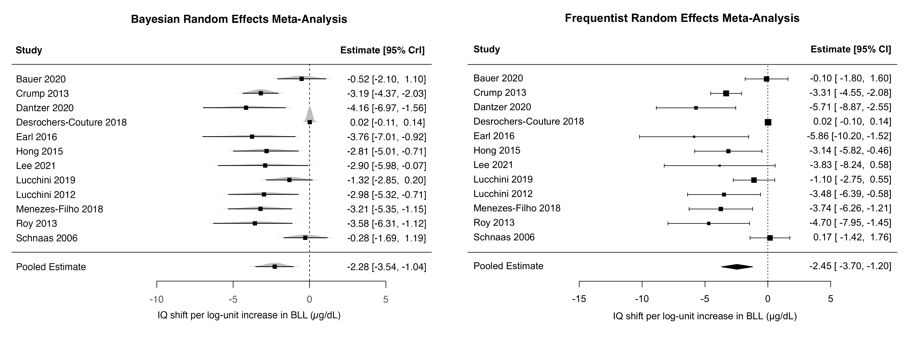

```{css echo = FALSE}
p {
  text-align: justify
}
```

\newpage

# Keywords {.unnumbered}
<!-- 3 to 10 keywords representing the main content of the article  -->
Meta-analysis\
Evidence synthesis\
Bayesian modelling\
Uncertainty quantification\
Lead exposure\
Environmental epidemiology\
<!-- Children's IQ\ -->

<!-- # Highlights {.unnumbered}
* Bayesian model yields full probability distributions, not just point estimates
* Bayesian and frequentist meta-analyses yield similar estimates for lead's effect on IQ
<!-- * Parallel approach allows for direct comparison of both frameworks -->
<!-- * Bayesian results support direct probability statements for risk assessment -->
<!-- * Results underscore the health risk of lead exposure, even at low concentrations -->

# Graphical abstract {.unnumbered}

{width=100% height=100% fig-align="center"}

# Abstract {.unnumbered}
```{r}
#| label: read_model
#| echo: false

m.brm <- readRDS("../models/main/m.brm_full.rds")
fitPrior <- readRDS("../models/main/fitPrior_full.rds")
freq_model <- readRDS("../models/main/freq_full.rds")
```

```{r}
#| label: extract_results
#| echo: false
#| message: false
#| warning: false

library(posterior)
library(HDInterval)
library(brms)
library(metafor)

data <- read.csv("../data/study_data_leadIQloss.csv")

frnd <- function(val, digits = 2) sprintf(paste0("%.", digits, "f"), val)
frnd_pct <- function(val, digits = 1) sprintf(paste0("%.", digits, "f"), val)

freq_mean <- frnd(freq_model$beta)
freq_lb <- frnd(freq_model$ci.lb)
freq_ub <- frnd(freq_model$ci.ub)

# tau2 for frequentist model
freq_confint <- confint(freq_model)
freq_confint <- freq_confint$random

m.brm_samples <- as_draws_df(m.brm)
Bayes_mean <- frnd(mean(m.brm_samples$b_Intercept))

# hdi(m.brm_samples$b_Intercept, credMass = 0.95)
hdi <- quantile(m.brm_samples$b_Intercept, c(0.025, 0.975))
Bayes_lb <- frnd(hdi[1])
Bayes_ub <- frnd(hdi[2])

# calculate tau2 and I2 analogous to metafor
# Extract posterior samples of tau
tau_samples <- as_draws_df(m.brm, variable = "sd_author_year__Intercept")
tau_sq_samples <- tau_samples$sd_author_year__Intercept^2

# Get the SAME typical within-study variance that metafor used
vt <- freq_model$vt

# Calculate I² using metafor's approach for each posterior draw
I2_samples <- tau_sq_samples / (tau_sq_samples + vt)

# summarise tau2
tau_sq_mean <- mean(tau_sq_samples)
tau_sq_median <- median(tau_sq_samples)
tau_sq_ci <- quantile(tau_sq_samples, c(0.025, 0.975))

# summarise I2
I2_posterior_mean <- mean(I2_samples)
I2_posterior_median <- median(I2_samples)
I2_credible_interval <- quantile(I2_samples, c(0.025, 0.975))
```

<!-- max 350 words in BMC  -->
**Background**: 
Uncertainty quantification is central to evidence synthesis for risk assessment and policy-making.
Frequentist meta-analysis - currently predominant in epidemiology - quantifies uncertainty through confidence intervals, while Bayesian meta-analysis provides a different approach to uncertainty quantification through posterior distributions.
We performed frequentist and Bayesian meta-analyses to compare uncertainty quantification and applicability for risk assessment using lead exposure and children's IQ as a case study.

<!-- Uncertainty quantification is central to evidence synthesis for risk assessment and policy-making, but frequentist meta-analytic approaches - currently predominant in epidemiology - often fall short in this regard.
Bayesian meta-analysis provides probabilistic uncertainty quantification.
We performed frequentist and Bayesian meta-analyses to compare uncertainty quantification and applicability for risk assessment using lead exposure and children's IQ as a case study. -->

**Methods**: We systematically searched PubMed and Scopus for epidemiological studies on blood lead level (BLL) and IQ score in children.
After screening, risk of bias (RoB) in the identified studies was assessed and regression coefficients were harmonised to the $\log_e$​ scale.
In both meta-analyses, we included the same effect estimates, assumed a multilevel structure and used random-effects models.
The Bayesian meta-analysis employed a hierarchical model with weakly-informative priors.
Sensitivity analyses examined robustness to RoB and to prior specification.
$\tau^2$ and $I^2$ were estimated as measures of between-study heterogeneity.

**Results**: Twelve studies were included in the meta-analysis.
The frequentist model yielded a pooled estimate of `r freq_mean` (95% confidence interval: `r freq_lb` to `r freq_ub`) IQ points per unit increase in $\log_e$-transformed BLL (µg/dL).
The Bayesian model yielded a mean pooled estimate of `r Bayes_mean` (95% credible interval: `r Bayes_lb` to `r Bayes_ub`).
Between-study heterogeneity was substantial (frequentist: $\tau^2$ = `r frnd(freq_confint[1,1])`, $\text{I}^2$ = `r frnd_pct(freq_confint[3,1])`%; Bayesian: posterior median $\tau^2$ = `r frnd(tau_sq_median)`, $\text{I}^2$ = `r frnd_pct(I2_posterior_median * 100)`%).
The Bayesian approach provided a full posterior distribution for heterogeneity, directly quantifying uncertainty from between-study variation.
Sensitivity analyses showed both meta-analyses were robust to RoB, and Bayesian estimates were insensitive to tested priors.
Depending on the specified prior configuration, the Bayesian model was less sensitive to studies reporting substantial uncertainty, resulting in a lower pooled effect compared to the frequentist model.
This regularisation is particularly valuable in small meta-analyses, where frequentist heterogeneity estimates can be unstable.

**Conclusions**: We provide updated pooled estimates for the effect of lead exposure on children's IQ covering the literature between January 2005 and July 2023.
The Bayesian framework provides posterior distributions, enabling direct probability statements, e.g. about exceeding risk thresholds, and comparative assessments between pollutants.
These features are particularly valuable for risk assessment and policy-making.

\newpage


# Background
Lead (Pb) is a pervasive environmental pollutant originating from anthropogenic and natural sources.
Although concentrations have declined globally in past decades following the phase-out of leaded gasoline, lead remains present in the environment and is detected in human blood samples [@salamanca-fernandez2025SociodemographicDeterminantsTemporal; @lacerda2023GlobalDecreaseBlood].
In Europe, primary exposure sources include dietary products, drinking water, and indoor dust [@europeanfoodsafetyauthority2012LeadDietaryExposure; @sy2024AssessmentLongTermExposure].
The most recent Global Burden of Disease study estimated that in 2023, 3.4 million Disability-Adjusted Life Years	(DALYs, 95% uncertainty interval (UI): 2.7 to 4.0 million) were attributable to lead exposure in the European Union (EU) [@hay2025Burden375Diseases].
This underscores the continued public health significance even of low-level exposure.

Exposure to lead is associated with multiple adverse health outcomes across the human life course, including
decreased kidney function [@harari2018BloodLeadLevels],
liver disease [@wan2022ChronicLeadExposure],
coronary artery atherosclerosis [@rosengren2025ExposureLeadCoronary],
cardiovascular mortality [@lanphear2018LowlevelLeadExposure],
infertility in women [@chang2006LowBloodLead],
attention-deficit/hyperactivity disorder in children [@dimitrov2024SystematicReviewMetaanalysis], and
antisocial behaviour [@shaffer2025LeadExposureAntisocial].
Among these endpoints, impaired cognitive development in children — observable as reduced intelligence quotient (IQ) scores — represents a particularly critical endpoint with high public health relevance [@baghurst1992EnvironmentalExposureLead; @needleman1990LowLevelLeadExposure; @bellinger1992LowLevelLeadExposure; @lanphear2005LowLevelEnvironmentalLead].
Children are especially vulnerable to the neurotoxic effects of lead due to their developing nervous systems and relatively high exposure per body mass.
Because lead-associated IQ decrements are irreversible and persist throughout life, they lead to substantial and enduring societal costs, making continued efforts to accurately characterise the exposure-response relationship important for evidence-based policy [@larsen2023GlobalHealthBurden].

Blood lead levels (BLL) in the EU have declined markedly and now predominantly fall below 5 µg/dL, well below the concentrations examined in many earlier studies (<10 µg/dL) [@tamasszigeti2022SubstanceReportLead].
Importantly, there is no evidence for a threshold concentration below which the effects of lead on IQ can be assumed to be negligible [@efsapaneloncontaminantsinthefoodchaincontam2010ScientificOpinionLead; @schwartz1994LowLevelLeadExposure].
There is evidence for a supralinear exposure-response relationship with steeper IQ decrements per unit increase in BLL at low concentrations compared to higher concentration ranges [@canfield2003IntellectualImpairmentChildren; @lanphear2005LowLevelEnvironmentalLead].
These findings highlight the need for an updated quantitative synthesis that reflects both recent epidemiological evidence and the lower exposure range now predominant in European populations, incorporating recent data to inform risk assessment at currently relevant exposure levels.

Existing burden of disease assessments at national and global scales [@hay2025Burden375Diseases; @carrington2019GlobalBurdenIntellectual; @figueroa2024LossCognitiveFunction; @larsen2023GlobalHealthBurden; @mcfarland2022HalfUSPopulation] have predominantly relied on the foundational study by Lanphear et al. (2005), a pooled analysis of seven cohort studies, or subsequent re-analyses of the same data [@lanphear2005LowLevelEnvironmentalLead; @crump2013StatisticalReevaluationData].
While these landmark studies have substantially shaped research and policy on childhood lead exposure, methodological issues and shortcomings have been raised.
These include the use of performance IQ instead of full-scale IQ and an erroneous back-transformation of BLL in one cohort in the Lanphear et al. study [@lanphear2019ErratumLowLevelEnvironmental; @crump2013StatisticalReevaluationData].
These limitations, combined with the availability of more recent epidemiological data, underscore the need not only for an updated evidence synthesis, but also for methodologically robust approaches that can provide reliable exposure-response estimates to be used in burden of disease and risk assessments.

Methodological advances in meta-analysis offer an opportunity to enhance the utility of synthesised estimates for burden of disease and risk assessment applications.
While frequentist meta-analysis has been a conventional approach in environmental epidemiology, Bayesian meta-analysis provides a coherent framework for uncertainty quantification through posterior distributions that inherently incorporate both within-study and between-study variability [@grant2025BayesianMetaAnalysisPractical].
Unlike frequentist confidence intervals, which are often misinterpreted as having a 95% probability of containing the unknown parameter [@hoekstra2014RobustMisinterpretationConfidence], Bayesian credible intervals directly represent the probability distribution of the parameter of interest, facilitating transparent communication of uncertainty.
Furthermore, Bayesian posterior distributions can be directly propagated into probabilistic burden of disease and risk assessments, providing seamless integration with probabilistic frameworks in public health decision-making.
By comparing frequentist and Bayesian approaches, we explore how the analytical framework and its approach to uncertainty quantification influence exposure-response estimates and their application.

The aim of this study is to compare uncertainty quantification of frequentist and Bayesian meta-analyses.
We apply both meta-analytic approaches to the association between BLL and IQ scores in children using the results of a systematic review on epidemiological studies published between January 2005 and July 2023, thereby also providing an updated pooled effect estimate of this association.
<!-- If ever necessary, we could add a sentence saying "However, a general comparison of both frameworks is not our goal because it is not possible based on this single study" -->

# Methods
## Literature Review
This review adheres to the Preferred Reporting Items for Systematic reviews and Meta-Analyses (PRISMA) guidelines [@page2021PRISMA2020Statement].
The checklist can be found in additional file 1.
The reporting of the Bayesian methods and their results was guided by the Bayesian Analysis Reporting Guidelines (BARG) [@kruschke2021BayesianAnalysisReporting].

We conducted a literature review to identify published studies investigating the association between postnatal (concurrent) exposure to Pb and IQ loss in children.
This study was conducted within the EU-funded project *"Partnership for the Assessment of Risks from Chemicals" (PARC)* [@2026PartnershipAssessmentRisks].
The literature review presented here was used in multiple case studies within PARC, including one on the health burden of (methyl)mercury and lead on IQ loss.
Here, we will only report results for concurrent lead exposure and IQ loss, but the figures and tables documenting the literature review contain parts of the search for other associations and exposure timeframes.
We searched for articles published between January 2005 and July 2023.
The year 2005 was chosen because burden of disease studies have predominantly relied on a landmark paper published in that year [@lanphear2005LowLevelEnvironmentalLead] and an update of the evidence base is therefore warranted, particularly given that lead exposure concentrations have decreased substantially since then.

Search queries in PubMed (MEDLINE) and Scopus included the following terms:
substance (Pb - including Medical Subject Headings [MeSH] terms), outcome (IQ and neurodevelopment), population (children) and results (association, exposure-response function [ERF]) (additional file 2).

All titles and abstracts were screened by two reviewers.
Any conflicts were resolved by a third person.
Full texts were then assessed by one reviewer.
Publications were considered relevant according to predefined PECOTS – Population, Exposure, Comparator, Outcome, Timing of exposure and Setting (Table 1).

```{r}
#| label: table_1_PECOTS
#| echo: false
#| message: false
#| warning: false
#| classes: plain

library(gt)
library(tidyverse)

Table1 <- read_csv("tables_figures/main/table1.csv")

Table1 |>
  gt() |>
  tab_header(
    title = "Table 1: PECOTS criteria"
  ) |>
  tab_source_note(
    source_note = "HBM, human biomonitoring"
  ) |>
  tab_options(
    table.font.size = 11,
    table.width = "50%",
    heading.align = "left"
  )
```

We excluded reviews and background articles that inventoried the literature without quantitatively summarising the results.
We also excluded references written in languages other than English.
For this present study, only studies that used a continuous, log-transformed BLL scale were included, so that effect estimates could be harmonised.
The exposure timeframe for this study was restricted to concurrent, i.e. IQ and BLL measurements must have been conducted at the same time.
Descriptive study data was extracted using a grid based on the one proposed by the Office of Health Assessment and Translation within the US National Toxicology Program [@ntpohat2019HandbookConductingLiteratureBased].
For all included studies, effect estimates from the most-adjusted model were extracted and the adjustment set was recorded.

## Risk of Bias Assessment
To assess study quality, we conducted a risk of bias assessment using the rapid Risk of Bias (RoB) tool with a specific focus on human observational epidemiological studies [@plate2024DevelopmentToolRapid].
Each included publication was assessed for RoB in the following domains: selection, exposure, outcome, confounding, follow-up, analysis, and selective reporting.
In total, each study was evaluated using 15 items and scored as either high RoB (-), some concerns (+/-), low RoB (+) or no information (?).
If an item was not applicable to the study type (e.g. follow-up in cross-sectional studies), they were marked as "n.a.".
The overall RoB for each individual study was then categorised as either low, moderate or high, following two different summary metrics provided by the RoB tool (for more details, please refer to @plate2024DevelopmentToolRapid).
Each publication was first assessed by one researcher.
Subsequently, consensus with the large language model (LLM) Claude Sonnet 4.6 (Anthropic) was sought.
This was done by uploading the list of all RoB items along with the respective publication.
Then, the LLM was prompted to assess the study, using the RoB items.
If there were any deviations in the judgement of the researcher and the LLM, the respective item was revisited by the researcher who made the final decision.

## Harmonisation of Effect Estimates
Studies investigating the association between lead exposure and IQ in children have made different assumptions regarding the shape of the ERF.
While some studies assume a linear relationship [@halabicky2023LowLevelLead; @chen2005IQBloodLead], this assumption may only be valid within very narrow concentration ranges [@crump2013StatisticalReevaluationData].
Studies that tested multiple shapes of the ERF have concluded that a log-linear relationship, where BLL are logarithmically transformed, represents a more appropriate statistical model [@schnaas2006ReducedIntellectualDevelopment; @crump2013StatisticalReevaluationData].

The general form of regression model used for a log-linear association is:
$$
\text{y}_{pred} = \alpha + \beta \times {log_{b}}(X) + \varepsilon
$$ {#eq-regression-model}

Where $\text{y}_{pred}$ represents the IQ score, $\alpha$ is the intercept, $\beta$ is the regression coefficient (slope), $X$ denotes BLL, $b$ is the logarithmic base, and $\varepsilon$ is the error term.

In the literature, different logarithmic bases are used to transform BLL, including the natural logarithm ($\log_e$,​ where $e \approx 2.718$), base 2, and base 10.
To enable pooling of the effect estimates, we harmonised all regression coefficients and their standard error (SE) to increments on the natural logarithm scale ($\log_e$).
The calculations are documented in additional file 3.
In some publications, BLL was not on a logarithmic but on an untransformed, linear scale.
These were excluded from the meta-analysis, as transformation of effect estimates for linear BLL to log-linear could not be justified.

## Meta-Analysis
In order to quantitatively synthesise the available epidemiological literature on the association of children's blood lead levels and IQ, we conducted separate meta-analyses in the Bayesian and frequentist analytical framework, and compared their results.
To make the results of both approaches comparable, both included the same effect estimates from the identified publications, and featured analogous model structure.
We estimated pooled effect estimates for the loss of IQ points per continuous unit increase in $\log_e$-transformed BLL (µg/dL).
R version 4.4.2 (2024-10-31) was used for all computations [@rcoreteam2024LanguageEnvironmentStatistical].
All code for this study is publicly available on GitHub [@2026GitHub].

### Bayesian Meta-Analysis
In the Bayesian framework, we employed a random-effects meta-analysis model.
Each study's observed effect size $\hat{\theta}_{k}$ is modelled as a noisy reflection of the true underlying effect in that study’s sample $\theta_{k}$, with the noise represented by the within-study sampling error $\sigma_{k}$ ​(treated as known based on reported study statistics).
These study-specific true effects are themselves modelled as draws from an overarching normal distribution which describes the true average effect across studies $\mu$ and the between-study heterogeneity $\tau$.

$$
\begin{split}
\hat{\theta}_{k} &\sim \mathcal{N}(\theta_{k}, \sigma_{k}) \\
\theta_{k} &\sim \mathcal{N}(\mu, \tau)
\end{split}
$$ {#eq-model}

Where $\hat{\theta}_{k}$ is the observed effect size for study $k$, $\sigma_{k}$ is the within-study sampling standard deviation for study $k$, $\theta_{k}$ is the true underlying effect for study $k$, $\mu$ is the overall pooled effect and $\tau$ is the between-study standard deviation (heterogeneity).
The Bayesian model was fit using the R package `brms` version 2.22.0 [@burkner2017BrmsPackageBayesian].
Sampling was done using Markov chain Monte Carlo (MCMC).
We ran four chains with 4,000 iterations each, of which 2,000 iterations were discarded as warmup, resulting in 8,000 total post-warmup draws.
MCMC convergence was assessed using traceplots and the Gelman-Rubin statistic ($\hat{R}$).
Chain resolution was assessed using the effective sample size (ESS).
Heterogeneity $\tau$ was directly modelled as a parameter (@eq-model).
$I^2$ was calculated using the typical within-study variance calculated with `metafor` for each $\tau^2$ posterior sample.
Because the posterior distribution of $\tau^2$ is right-skewed, we summarise $\tau^2$ and $I^2$ by their posterior medians rather than their posterior means, as the median represents the typical value more faithfully and keeps the reported point estimates consistent with their credible intervals (for further detail, see additional file 4).

In the Bayesian framework, domain knowledge is elicited and captured as probability distributions (priors) which are subsequently updated by the newly observed data, resulting in a posterior distribution.
Prior distributions are specified for all model parameters, i.e. the overall pooled effect estimate $\mu$ and between-study standard deviation (heterogeneity) $\tau$.
For both parameters, weakly-informative priors were chosen to softly constrain the posterior distributions to realistic ranges of results.
The priors are specified on the same scale as the harmonised effect estimates (IQ shift per unit increase in $\log_e$-transformed BLL).

```{r}
#| label: prior_assumption
#| echo: false

prob_prior_mu <- 0.95
prior_mean <- -1
prior_sd <- 2

lb_prior <- qnorm(((1 - prob_prior_mu) / 2), prior_mean, prior_sd)
ub_prior <- qnorm((1 - (1 - prob_prior_mu) / 2), prior_mean, prior_sd)
```

For the overall pooled effect $\mu$, a normally distributed prior centred at `r prior_mean` with a standard deviation (SD) of `r prior_sd` was chosen.
This reflects the prior belief that the overall pooled effect lies between `r round(lb_prior)` and `r round(ub_prior)` with $\sim$ `r prob_prior_mu * 100`% probability.
The centre point of the prior was chosen to be `r prior_mean` because the negative effects of lead on the developing nervous system and its toxicological mechanisms of action are well established [@efsapaneloncontaminantsinthefoodchaincontam2010ScientificOpinionLead].
Since variance terms, such as the between study heterogeneity $\tau$, must be positive, a truncated normal distribution centred at 0 with a SD of 2 was specified.
This reflects the prior belief that heterogeneity $\tau$ is small to moderate, but does not exclude large heterogeneity if this is present in the included studies.
In summary, the following priors were specified for the Bayesian model:

$$
\begin{split}
\mu &\sim \mathcal{N}(-1, 2) \\
\tau &\sim \mathcal{N^+}(0, 2)
\end{split}
$$ {#eq-priors}

<!-- Note about non-informative / flat priors? They grant the unrealistic cases of effects of say -1000, 0 and 1000 the exact same probability, which we know from research and common sense is not realistic. Also, it might cause convergence issues in the MCMC sampling process. -->
Prior predictive checks were conducted using the `bayesplot` package [@gabryjmahrt2025BayesplotPlottingBayesian] to verify that the specified priors were appropriate.
Posterior predictive checks were carried out to assess if the model structure is able to capture the underlying data well.
Additionally, a sensitivity analysis with alternative priors was conducted, as described below.

### Frequentist Meta-Analysis
For the frequentist meta-analysis, we employed a random-effects model with a small-sample adjustment, assuming the same multilevel structure as for the Bayesian model (@eq-model) [@hartung2001TestsOverallTreatment].
Parameters were estimated via the restricted maximum-likelihood estimation from the R package `metafor` version 4.8-0 [@wolfgangviechtbauer2010ConductingMetaanalysesMetafor].
The $I^2$ statistic was calculated as a measure of heterogeneity, representing the proportion of total variation attributable to between-study heterogeneity $\tau^2$.

## Sensitivity Analysis
We conducted two sets of sensitivity analyses.
To examine the sensitivity of the results to possibly biased study estimates, we ran both the frequentist and Bayesian models again twice, excluding (1) studies with a high RoB rating and (2) with a high or moderate RoB.

To examine the sensitivity of the results to the choice of prior distributions, we fit the Bayesian model again for alternative sets of priors that we consider to be extreme but still reasonable.
One set of priors was more informative (narrower) than the main priors, with $\mu \sim \mathcal{N}(-1, 1)$ and $\tau \sim \mathcal{N}^+(0, 1)$.
A second set of priors was less informative (ignorant) with $\mu \sim \mathcal{N}(0, 6)$ and $\tau \sim \mathcal{N}^+(0, 6)$.
Note that for $\mu$, the broader prior is centred at 0, giving equal weight to the probability of a protective and detrimental effect of lead.
To be able to identify the individual impact of the prior settings for $\mu$ and $\tau$, we varied one of the two parameters while holding the other constant.
The location of the $\mu$ prior was varied to values a third and three times that of the default value, while $\tau$ was held at $\mathcal{N}^+(0, 2)$, and the same was done for the scale of the $\tau$ prior while holding $\mu$ at $\mathcal{N}(0, 100)$ (Table 4).
We decided to hold $\mu$ at $\mathcal{N}(0, 100)$ instead of using the values from the main analysis $\mathcal{N}(-1, 2)$ because it allowed us to examine if Bayesian and frequentist estimates converge under a very wide $\mu$ prior and weak shrinkage.

# Results
## Literature Review
The systematic review was conducted with a larger scope and was used as a basis for multiple case studies within the PARC project, which is why it includes another substance (mercury, Hg).
The systematic search in PubMed and Scopus yielded 1,073 records for lead.
After duplicate removal, title and abstract of 974 records (Pb & Hg) were screened, which left 149 records (Pb & Hg) for full text screening.
After this last screening, 36 records remained for Pb.
These were then assessed for their eligibility for the meta-analysis.
Twelve studies were excluded because they either transformed the BLL variable into categories or left it on a linear (untransformed) scale.
Four studies were excluded because they exclusively assessed the effects of prenatal lead exposure.
Furthermore, four studies were excluded because the cohorts overlapped with another study and would lead to duplicates.
Four additional studies were excluded because they either solely reported effects of chemical mixtures, used non-linear models (including the use of splines) or failed to report essential statistics.
Finally, twelve studies were included in the meta-analysis.
Study characteristics and regression coefficients (effect estimates) are shown in Table 2.

```{r}
#| label: table_2_study-char
#| echo: false
#| message: false
#| warning: false
#| classes: plain

Table2 <- read_csv("tables_figures/main/table2.csv")

Table2 |>
  gt() |>
  tab_header(
    title = "Table 2: Study Characteristics"
  ) |>
  tab_source_note(
    source_note = "ADHD-RS, Attention Deficit Hyperactivity Disorder Rating Scale; BMI, Body Mass Index; CPT, Continuous Performance Test; ERF, exposure-response function; FSIQ, full scale IQ; HOME, Home Observation for Measurement of the Environment; SE, standard error; SES, socioeconomic status; WASI, Wechsler Abbreviated Scale of Intelligence, WISC, Wechsler Intelligence Scale for Children; WPPSI, Wechsler Preschool and Primary Scale of Intelligence"
  ) |>
  opt_css(
    "
    .gt_table th:nth-child(3){
      min-width: 200px !important
    }
    .gt_table td:nth-child(9) {
      min-width: 250px !important
    }
  "
  ) |>
  tab_options(
    table.font.size = 12,
    table.width = "100%",
    heading.align = "left"
  )
```

A PRISMA flow diagram summarising the review process is shown in Fig. 1 [@page2021PRISMA2020Statement].
Detailed information on the screening process and exclusion reasons can be found in additional file 3.

{width=60% fig-align="center"}

The size of the study population in included studies ranged from 127 [@earl2016LowlevelEnvironmentalLead] to 1,355 [@crump2013StatisticalReevaluationData].
Study designs included cross-sectional [@bauer2020AssociationsMetalMixture; @hong2015EnvironmentalLeadExposure; @lucchini2012InverseAssociationIntellectual; @lucchini2019NeurocognitiveImpactMetal; @roy2013EffectModificationTransferrin; @schnaas2006ReducedIntellectualDevelopment] and cohort studies [@crump2013StatisticalReevaluationData; @dantzer2020ComparisonBloodToenails; @desrochers-couture2018PrenatalConcurrentSexspecific; @earl2016LowlevelEnvironmentalLead; @lee2021PrenatalPostnatalExposures].
The included studies were conducted in multiple different regions of the world (North America: 4, South America: 1, Europe: 3, Asia: 3, Australia: 1) and some populations were sampled in hotspot regions with presumably higher lead concentrations [@bauer2020AssociationsMetalMixture; @earl2016LowlevelEnvironmentalLead; @menezes-filho2018EnvironmentalCoExposureLead].
The study by @roy2013EffectModificationTransferrin reported implausibly large effect sizes.
We contacted the corresponding author, who confirmed that decimal points were missing in the publication.

## Risk of Bias
The rapid RoB assessment resulted in eight studies with a low RoB rating [@bauer2020AssociationsMetalMixture; @dantzer2020ComparisonBloodToenails; @desrochers-couture2018PrenatalConcurrentSexspecific; @hong2015EnvironmentalLeadExposure; @lee2021PrenatalPostnatalExposures; @menezes-filho2018EnvironmentalCoExposureLead; @roy2013EffectModificationTransferrin; @schnaas2006ReducedIntellectualDevelopment],
two with a moderate RoB [@lucchini2012InverseAssociationIntellectual; @lucchini2019NeurocognitiveImpactMetal]
and two studies with a high RoB rating [@crump2013StatisticalReevaluationData; @earl2016LowlevelEnvironmentalLead].
Among the twelve included studies, items with a high overall RoB were *non-response rate* (7x high RoB, 5x some concerns), where some studies did not report the non-response rate or did not discuss whether non-responding individuals might systematically differ from included participants, leading to potential selection bias.
Another item with overall high RoB was *accounting for confounding* (2x high RoB, 5x some concerns), where important confounders like maternal IQ were not included or the authors used a data-driven selection approach for covariate selection, when a theory-driven approach was preferable [@smith2018StepAwayStepwise].
Finally, in the item *handling of missing values*, some of the studies contained no information on how missing data was handled, while in other studies they were handled inadequately (3x high RoB, 4x some concerns).
Results from the RoB assessment are presented in Table 3.

```{r}
#| label: table_3_RoB
#| echo: false
#| message: false
#| warning: false
#| fig-cap-location: top
#| classes: plain

Table3 <- read_csv("tables_figures/main/table3.csv")

rob_cols <- 2:17

rob_colors <- list(
  "+" = "#e2e2e2",
  "low" = "#e2e2e2",
  "+/-" = "#b0b0b0",
  "moderate" = "#b0b0b0",
  "-" = "#818181",
  "high" = "#818181",
  "?" = "#818181",
  "n.a." = "#FFFFFF"
)

gt_table <- Table3 |>
  gt() |>
  tab_header(
    title = "Table 3: Risk of Bias Assessment"
  ) |>
  tab_source_note(
    source_note = "RoB, risk of bias; (-), high RoB; (+/-), some concerns / moderate; (+), low RoB; (?), no information; (n.a.), not applicable"
  ) |>
  tab_options(
    table.font.size = 12,
    heading.align = "left"
  ) |>
  cols_align(align = "center", columns = everything()) |>
  cols_align(align = "left", columns = "Study, year") |>
  tab_spanner(label = "Selection", columns = 2:5) |>
  tab_spanner(label = "Exposure", columns = 6:7) |>
  tab_spanner(label = "Outcome", columns = 8:9) |>
  tab_spanner(label = "Confounding", columns = 10:11) |>
  tab_spanner(label = "Follow-up", columns = 12:13) |>
  tab_spanner(label = "Analysis", columns = 14:15) |>
  tab_spanner(label = "Selective Reporting", columns = 16) |>
  tab_spanner(label = "Overall Risk of Bias", columns = 17)

# Apply cell-level coloring per column and per value
for (col in names(Table3)[rob_cols]) {
  for (val in names(rob_colors)) {
    gt_table <- gt_table |>
      tab_style(
        style = cell_fill(color = rob_colors[[val]]),
        locations = cells_body(
          columns = all_of(col),
          rows = .data[[col]] == val
        )
      )
  }
}

gt_table
```

## Meta-Analysis
```{r}
#| label: extract_results2
#| echo: false
#| message: false

# tau2 for frequentist model
freq_confint <- confint(freq_model)
freq_confint <- freq_confint$random
freq_tau2_mean <- freq_confint[1, 1]
freq_tau2_lb <- freq_confint[1, 2]
freq_tau2_ub <- freq_confint[1, 3]

# I2 for freq model
freq_I2_mean <- freq_confint[3, 1]
freq_I2_lb <- freq_confint[3, 2]
freq_I2_ub <- freq_confint[3, 3]

m.brm_samples <- as_draws_df(m.brm)
Bayes_mean <- frnd(mean(m.brm_samples$b_Intercept))


hdi <- quantile(m.brm_samples$b_Intercept, c(0.025, 0.975))
Bayes_lb <- frnd(hdi[1])
Bayes_ub <- frnd(hdi[2])

# calculate tau2 and I2 analogous to metafor
# Extract posterior samples of tau
tau_samples <- as_draws_df(m.brm, variable = "sd_author_year__Intercept")
tau_sq_samples <- tau_samples$sd_author_year__Intercept^2

# Get the SAME typical within-study variance that metafor used
vt <- freq_model$vt

# Calculate I² using metafor's approach for each posterior draw
I2_samples <- tau_sq_samples / (tau_sq_samples + vt)

# summarise tau2
tau_sq_mean <- mean(tau_sq_samples)
tau_sq_median <- median(tau_sq_samples)
tau_sq_ci <- quantile(tau_sq_samples, c(0.025, 0.975))

# summarise I2
I2_posterior_mean <- mean(I2_samples)
I2_posterior_median <- median(I2_samples)
I2_credible_interval <- quantile(I2_samples, c(0.025, 0.975))

# summary for Rhat
s_brm <- summary(m.brm)
```

The prior predictive check indicated that the specified priors were appropriate (additional file 5a).
The posterior predictive check showed that the model correctly captured important patterns in the data (additional file 5b).
$\hat{R}$ values indicated that all MCMC chains converged (`r frnd(s_brm$fixed[,"Rhat"])` for both $\mu$ and $\tau$).
MCMC trace plots showed well-mixed chains and convergence (additional file 5c).
ESS indicated that sampling was efficient and central point estimates and credible intervals could be interpreted with confidence (ESS bulk for $\mu$: `r format(round(s_brm$fixed[,"Bulk_ESS"], 0), big.mark = ",")`; ESS tail: `r format(round(s_brm$fixed[,"Tail_ESS"], 0), big.mark = ",")`, corresponding to `r frnd_pct((s_brm$fixed[, "Bulk_ESS"]) / (s_brm$total_ndraws) * 100)`% and `r frnd_pct((s_brm$fixed[, "Tail_ESS"]) / (s_brm$total_ndraws) * 100)`% of total samples respectively).

The Bayesian random-effects meta-analysis yielded a posterior mean pooled estimate of `r Bayes_mean` (95% credible interval (CrI): `r Bayes_lb` to `r Bayes_ub`) IQ points per log-unit increase in BLL (µg/dL) (see Fig. 2).
The frequentist approach produced a comparable pooled estimate of `r freq_mean` (95% confidence interval (CI): `r freq_lb` to `r freq_ub`).
Substantial between-study heterogeneity was observed under both frameworks.
In the Bayesian model, between-study heterogeneity was estimated as a posterior median $\tau^2$ of `r frnd(tau_sq_median)` (95% CrI: `r frnd(tau_sq_ci[1])` to `r frnd(tau_sq_ci[2])`), corresponding to an $\text{I}^2$ of `r frnd_pct(I2_posterior_median * 100)`% (95% CrI: `r frnd_pct(I2_credible_interval[1] * 100)`% to `r frnd_pct(I2_credible_interval[2] * 100)`%).
The frequentist model estimated a closely comparable $\tau^2$ = `r frnd(freq_tau2_mean)` (95% CI: `r frnd(freq_tau2_lb)` to `r frnd(freq_tau2_ub)`), with $\text{I}^2$ = `r frnd_pct(freq_I2_mean)`% (95% CI: `r frnd_pct(freq_I2_lb)`% to `r frnd_pct(freq_I2_ub)`%).
Additional file 6 contains the full model code and output for both models.
The results of both models are shown as forest plots in Figure 2.

::: {custom-style="Image Caption"}
{.lightbox}
:::

<!-- The single study estimates shown in Fig. 2 differ in both approaches because individual study estimates are shrunk towards the pooled estimate.
In the context of meta-analysis, shrinkage is comparable to the inverse-variance weighting in the frequentist framework. -->

The single study estimates shown in Fig. 2 differ between frameworks because Bayesian shrinkage pulls individual study estimates towards the pooled mean, borrowing information from the overall mean.
This has no equivalent in the frequentist framework, where the contribution of each study to the pooled effect is determined by inverse-variance weighting.
The degree of shrinkage does, however, depend on each study's precision in a way that parallels inverse-variance weighting: more precise studies are shrunk less (and are also weighted more heavily towards the frequentist pooled estimate), while less precise studies are shrunk more (and weighted less).

## Sensitivity Analysis

### Risk of Bias

For both the frequentist and Bayesian model, the strength of the mean pooled effect decreased after removing studies with high risk of bias and slightly increased again after removing high and moderate RoB studies.
These shifts in both directions and their small size showed that the results were robust to possible individual-study bias (Table 4).

### Prior Sensitivity

With more informative (narrower) priors ($\mu \sim \mathcal{N}(-1, 1)$, $\tau \sim \mathcal{N}^+(0, 1)$), the posterior mean of $\mu$ decreased (Table 4).
This is expected, because the narrow $\mu$ prior, together with stronger shrinkage, favours a tighter posterior distribution with effect ranges closer to -1, the mean of $\mu$'s prior.
When using less informative (ignorant) priors ($\mu \sim \mathcal{N}(0, 6)$, $\tau \sim \mathcal{N}^+(0, 6)$), the posterior mean of $\mu$ increased slightly compared to the main model.
This set of priors gives more weight to studies reporting high effects with large uncertainty ranges.

Varying the prior on the location of $\mu$ while holding $\tau$ at $\mathcal{N}^+(0, 2)$, we found neither skeptical nor enthusiastic priors on the location of $\mu$ substantially altered what we concluded from the estimates.
Varying the strength of shrinkage by decreasing or increasing the scale of $\tau$ while holding $\mu$ at $\mathcal{N}(0, 100)$ also did not substantially alter our conclusions.
The estimate for $\mu$ under weak shrinkage matched that of the frequentist analysis, while the estimate under strong shrinkage was notably more conservative. 
This is because many of the strongly negative coefficients were reported by studies with large uncertainty which are in turn more affected by shrinkage, pulling their estimands closer towards zero.

For further detail on these analyses, see additional file 5d-f for prior, likelihood and posterior distributions of all prior sensitivity analyses.

```{r}
#| label: table_4_sensi
#| echo: false
#| classes: plain
#| message: false
#| warning: false

library(here)
library(gt)

table_all <- bind_rows(
  readRDS(here("manuscript", "tables_figures", "main", "table_sensi.rds")),
  readRDS(here(
    "manuscript",
    "tables_figures",
    "main",
    "table_sensi_oneway.rds"
  ))
)

variant_labels <- c(
  main = "Main",
  narrow = "Narrow: mu=N(-1, 1), tau=N+(0, 1)",
  ignorant = "Ignorant: mu=N(0, 6), tau=N+(0, 6)",
  full = "Full sample",
  low = "Low RoB only",
  low_medium = "Low/Medium RoB"
)

variant_order <- c(
  "full",
  "low",
  "low_medium",
  "main",
  "narrow",
  "ignorant",
  "mu_skeptical",
  "mu_enthusiastic",
  "tau_default",
  "tau_strong",
  "tau_weak"
)

sensitivity_order <- c(
  "RoB",
  "Priors"
)

# Keep the results from the abstract, dodge MCSE noise
is_rob_full_bayes <- with(
  table_all,
  sensitivity == "RoB" & model_type == "Bayesian" & variant == "full"
)
is_priors_main <- with(
  table_all,
  sensitivity == "Priors" & model_type == "Bayesian" & variant == "main"
)
is_effect_default <- with(
  table_all,
  sensitivity == "Effect prior" & variant == "mu_default"
)
stopifnot(
  sum(is_rob_full_bayes) == 1,
  sum(is_priors_main) == 1,
  sum(is_effect_default) == 1
)
table_all[is_priors_main, c("mean", "lb", "ub")] <-
  table_all[is_effect_default, c("mean", "lb", "ub")]
table_all[is_rob_full_bayes, c("mean", "lb", "ub")] <-
  table_all[is_priors_main, c("mean", "lb", "ub")]
table_all <- table_all[!is_effect_default, ]

# No longer separate row groups for Effect / Heterogeneity prior -> merge
table_all$sensitivity[
  table_all$sensitivity %in% c("Effect prior", "Heterogeneity prior")
] <- "Priors"

# stopifnot(
#   all(table_all$variant %in% variant_order),
#   all(table_all$sensitivity %in% sensitivity_order)
# )

table4_gt <- table_all %>%
  mutate(
    variant_clean = coalesce(variant_label, unname(variant_labels[variant])),
    is_bold = (sensitivity == "RoB" & variant == "full") |
      (sensitivity == "Priors" &
        model_type == "Bayesian" &
        variant == "main"),
    sensitivity = factor(sensitivity, levels = sensitivity_order),
    model_type = factor(model_type, levels = c("Bayesian", "Frequentist")),
    variant = factor(variant, levels = variant_order),
    Estimate = sprintf("%s (%s, %s)", frnd(mean), frnd(lb), frnd(ub))
  ) %>%
  arrange(sensitivity, model_type, variant) %>%
  group_by(sensitivity, model_type) %>%
  mutate(
    model_display = ifelse(row_number() == 1, as.character(model_type), "")
  ) %>%
  ungroup() %>%
  select(sensitivity, model_display, variant_clean, Estimate, is_bold)

stopifnot(nrow(table4_gt) == 14, sum(table4_gt$is_bold) == 3)

bold_rows <- which(table4_gt$is_bold)

source_note <- paste(
  "RoB, risk of bias; UI, uncertainty interval (credible interval for Bayesian",
  "and confidence interval for frequentist model results).",
  "Configurations varying only the effect prior hold the heterogeneity prior at N+(0, 2);",
  "configurations varying only the heterogeneity prior hold the effect prior at",
  "Normal(0, 100), which is effectively flat but not improper.",
  "N+() denotes a Normal distribution with a lower bound of 0."
)

table4_gt %>%
  select(-is_bold) %>%
  gt(groupname_col = "sensitivity") %>%
  tab_header(
    title = "Table 4: Results of sensitivity analyses by framework"
  ) %>%
  tab_source_note(source_note = source_note) %>%
  opt_row_striping(row_striping = FALSE) %>%
  cols_label(
    model_display = "Framework",
    variant_clean = "Variant",
    Estimate = "Estimate (95% UI)"
  ) %>%
  cols_align(align = "left", columns = c(model_display, variant_clean)) %>%
  tab_style(
    style = cell_text(weight = "bold"),
    locations = cells_row_groups()
  ) %>%
  tab_style(
    style = cell_text(weight = "bold"),
    locations = cells_body(rows = bold_rows)
  ) %>%
  tab_options(
    table.width = pct(100),
    table.font.size = px(13),
    column_labels.font.weight = "bold",
  ) %>%
  tab_options(
    table.width = "50%",
    heading.align = "left"
  )
```

# Discussion
In this study, we compare uncertainty quantification of a frequentist and a Bayesian meta-analysis, which is less used in the field of environmental epidemiology to date, using lead exposure and children's IQ as an applied example.

While previous publications have compared both meta-analytic frameworks, they focus either on evidence-based medicine [@kazi2026PvaluesBayesFactor; @yao2025RandomeffectsMetaanalysisModels; @ciyer2025BayesianMetaanalysis21st; @hong2013ComparingBayesianFrequentist] or network meta-analysis [@sadeghirad2023TheoryPracticeBayesian; @seide2020ComparisonBayesianFrequentist] and thus address methodological challenges that only partially overlap with those encountered in environmental epidemiology.
To our knowledge, this is the first study to compare Bayesian and frequentist meta-analytic approaches in this field.

Pooled effect estimates and measures of heterogeneity were largely consistent across both models, though the Bayesian model yielded slightly lower mean pooled effects.
This is attributable to both the prior for the overall effect ($\mu$) and the posterior shrinkage of individual study estimates, influenced by the heterogeneity prior ($\tau$), as illustrated by the sensitivity analyses (Table 4).
Importantly, this difference does not relevantly affect the overall interpretation of the association between lead exposure and IQ.

The two frameworks may differ in how they treat studies reporting substantial uncertainty depending on prior configuration and sample size.
Bayesian meta-analysis can be set up such that it is less sensitive to these uncertain studies: a narrower prior distribution for the heterogeneity leads to stronger shrinkage, giving less weight to uncertain studies (Table 4).
In contrast, frequentist models rely on inverse-variance weighting that is fully determined by the data – studies with large uncertainty are weighted less, but the degree to which this happens cannot be configured by the researcher.
Setting the model up for stronger shrinkage via priors can therefore be particularly relevant in meta-analyses analysing only a small set of studies.
Here, the observed heterogeneity may be high simply due to the small sample size, leaving our pooled estimate prone to being disproportionately impacted by a handful of uncertain studies.

<!-- # Not sure I want the sentence below... it kind of asks for the add-on "and that's why Bayes and freq converge under large data", but that seems a bit off-topic here... -->
<!-- As with any other prior setting, the influence of the heterogeneity prior diminishes as the number of studies in our meta-analysis grows. -->

Conducting a Bayesian meta-analysis can be more demanding than frequentist approaches, requiring greater statistical knowledge, explicit consideration of modelling assumptions, and typically more programming effort [@gelman2020BayesianWorkflow].
While these demands may initially appear as disadvantages, they can equally be understood as methodological safeguards:
by requiring researchers to state assumptions explicitly rather than accepting software defaults, the Bayesian approach encourages deeper engagement with the data and statistical model.

A key distinction between the two frameworks is in how they handle parameter uncertainty.
Frequentist models yield point estimates with confidence intervals, whereas Bayesian models produce full posterior distributions.
This offers distinct practical advantages, particularly for risk assessment and policy-making.
First, any credible interval can be derived from the posterior distribution to meet the needs of researchers, decision-makers, or other stakeholders.
These allow direct probability statements about parameter values, unlike confidence intervals which are often incorrectly interpreted as probability statements about parameters.
Second, posterior distributions enable probabilistic comparisons across multiple health risks, such as calculating the probability that one risk exceeds another.
When meaningful effect sizes or risk thresholds are defined, exceedance probabilities can be directly obtained from the posterior, providing an intuitive and policy-relevant summary of uncertainty.
Posterior distributions together with the specified statistical model can be used to generate predictions for theoretical future studies, offering an additional way to characterise between-study heterogeneity.
They also enable researchers to estimate the population-level health impact of an exposure under specified conditions.
This is known as Environmental Burden of Disease (EBD).
In EBD studies, health impacts are quantified using metrics such as DALYs, allowing comparisons across health determinants within and across populations, countries, and time periods.
Such assessments integrate both population exposure and the exposure–response relationship [@pruss-ustun2003AssessingEnvironmentalBurden].
The distributional results of the present study enable probabilistic EBD assessments via Monte Carlo simulations without requiring additional assumptions about the uncertainty distribution of the exposure–response function.

Our results are consistent with previous toxicological and epidemiological evidence [@baghurst1992EnvironmentalExposureLead; @bellinger1992LowLevelLeadExposure; @lanphear2005LowLevelEnvironmentalLead; @efsapaneloncontaminantsinthefoodchaincontam2010ScientificOpinionLead] as well as prior meta-analyses on the effects of lead on IQ.
Direct comparison of effect magnitudes is, however, limited due to methodological differences: some studies estimated effects per exposure category [@goodman2023SexDifferencePre; @schwartz1994LowLevelLeadExposure; @pocock1994EnvironmentalLeadChildrens], while others reported partial $\text{r}$ [@needleman1990LowLevelLeadExposure] or standardised mean differences [@heidari2022EffectLeadExposurea].

The RoB sensitivity analysis indicated that results were generally robust to individual-study bias.
Notably, the study published by Crump et al. [@crump2013StatisticalReevaluationData], which is a re-analysis of the landmark study by Lanphear et al. [@lanphear2005LowLevelEnvironmentalLead], received a high RoB rating in our assessment.
Given that this re-analysis has informed multiple downstream analyses, including EBD assessments, its potential to introduce bias is a concern.
The primary driver of the high RoB rating was the use of stepwise backward-elimination regression, a method that has been extensively criticised [@thompson1995StepwiseRegressionStepwise; @harrell2015RegressionModelingStrategies; @smith2018StepAwayStepwise] and is central to the findings of Crump et al.
This underscores the value of the updated evidence synthesis provided here.

Substantial heterogeneity was observed in this meta-analysis, likely driven by differences in study populations (size, location, age, and exposure range) and statistical methods, particularly the covariate adjustment sets used.
Two studies reporting null effects were conducted in relatively low-exposed populations [@desrochers-couture2018PrenatalConcurrentSexspecific; @bauer2020AssociationsMetalMixture], where limited exposure variation reduces the detectability of an effect.
Differences in study location may also contribute: IQ tests not adapted to the target population can result in underestimated scores, which may apply to the study by Menezes-Filho et al. [@menezes-filho2018EnvironmentalCoExposureLead].
Additionally, studies reporting larger uncertainty tended to report larger effects, suggesting a possible presence of publication bias (additional file 5g).
The Bayesian approach was less sensitive to estimates from such studies, because the results of individual studies with large uncertainty were shrunk towards the pooled estimate, which is a particular advantage when pooling a small number of studies.

This study has several limitations that should be considered when interpreting the results.
A first set of limitations concerns the evidence base underlying the pooled estimate.
Our literature search was limited to the period between January 2005 and July 2023 and was not updated prior to submission.
Both the full-text screening and RoB assessment were done by only one person; while it would have been preferable to have multiple persons screen full texts and assess RoB independently, this was not feasible in this study due to resource constraints.
We further excluded studies that did not report effect estimates on the logarithmic scale of BLL.
While this reduced the number of studies available for pooling, exclusion was necessary to ensure interpretability, as combining effect estimates expressed on different scales would render the pooled estimate uninterpretable.
The studies we did include were heterogeneous with respect to covariate adjustment, exposure range, IQ measurement instrument and cohort characteristics, meaning that the coefficients pooled in this study may not represent exactly the same estimand.
Finally, publication bias was assessed through visual inspection only; formal statistical testing, such as Egger's test, would provide a more rigorous evaluation.
The visual assessment did not rule out publication bias, which may have led to overestimation of the pooled effect.
Taken together, these limitations mean that the pooled estimate should be read as reflecting the evidence available up to July 2023, and that its transferability to specific populations is limited.
Given this study's primary focus on comparing uncertainty quantification in two meta-analytic frameworks, however, they do not affect our main conclusions.

A second limitation concerns the scope of the comparison itself.
Whilst our study illustrates some of the differences of both Bayesian and frequentist approaches in the context of the data analysed here, it should not be taken as a comprehensive comparison of both statistical frameworks.
Such a comparison would require setting up a simulation study to systematically modify and quantify differences, which was outside the scope of the present study.
<!-- Concurrent exposure measurement (at the time of IQ testing) only partially captured the exposure window: it implicitly assumed that BLL was constant from the time of the exposure onset to the time the IQ measurement was taken.
Factors such as relocation to more or less lead exposed areas may lead to misclassification when using concurrent measurements, but such misclassification would likely be non-differential, biasing our results towards the null.
We prioritised this exposure timeframe because it enabled the inclusion of cross-sectional studies and yields pooled estimates directly applicable to environmental burden of disease assessments. -->

Despite these limitations, this study also has several important strengths.
By applying a parallel approach to both meta-analytic models — including the use of identical effect estimates, a multilevel random-effects model, and $I^2$ as a common measure of heterogeneity — we provide a direct comparison of a frequentist and a Bayesian random-effects meta-analysis.
To our knowledge, this is the first study to formally conduct such a comparison in the field of environmental epidemiology.
Beyond this methodological contribution, we provide an updated evidence synthesis on the association between lead exposure and children’s IQ based on a systematic literature review.
All data and code, including the code used to produce this manuscript, are publicly available, enabling other researchers to verify and build on our analyses.
Finally, we adhered to PRISMA and BARG reporting guidelines, along with the use of the raRoB tool for risk of bias assessment, ensuring consistency and rigour in study selection, data extraction, study quality appraisal, and statistical analysis.

# Conclusions
This study provides an applied methodological comparison of Bayesian and frequentist meta-analysis and an evidence synthesis of epidemiological studies examining the association between lead exposure and children's IQ.
The resulting pooled effect estimates are consistent with previous evidence and once again underscore the importance of reducing environmental lead contamination to reduce the public health burden this substance continues to impose.

In the context of our study, comparing both meta-analytic models showed that the Bayesian approach offered distinct advantages for risk assessment and policy-making by fully quantifying uncertainty – especially the ability to incorporate prior knowledge, comprehensively quantify uncertainty, and produce probabilistic outputs that are more directly useable for decision-makers.
While the Bayesian framework currently demands greater statistical knowledge and programming effort than the frequentist approach, these barriers are likely to diminish if the framework gains wider adoption and training becomes more accessible.
We believe that the benefits gained outweigh the investments made and therefore want to encourage researchers to consider Bayesian methods.

# List of Abbreviations {.unnumbered}
```{r}
#| label: table_abbreviations
#| echo: false
#| classes: plain

Meaning <- c(
  "Bayesian Analysis Reporting Guidelines",
  "Blood lead level",
  "Confidence interval",
  "Credible interval",
  "Disability-adjusted life years",
  "Environmental Burden of Disease",
  "Exposure-response function",
  "European Union",
  "Intelligence quotient",
  "Large language model",
  "Preferred Reporting Items for Systematic reviews and Meta-Analyses",
  "Risk of bias",
  "Standard deviation",
  "Standard error",
  "Uncertainty interval"
)
Abbreviation <- c(
  "BARG",
  "BLL",
  "CI",
  "CrI",
  "DALY",
  "EBD",
  "ERF",
  "EU",
  "IQ",
  "LLM",
  "PRISMA",
  "RoB",
  "SD",
  "SE",
  "UI"
)
table_abbr <- data.frame(Abbreviation, Meaning)

knitr::kable(table_abbr)
```

# Supplementary Information {.unnumbered}

- Additional file 1; .docx; PRISMA 2020 checklist; Table containing all PRISMA 2020 items and the location where the items are reported
- Additional file 2; .xlsx; Search queries; Full search queries for the systematic review
- Additional file 3; .xlsx; Literature review summary; Summary of the literature review process, incl. details on exclusion reasons and the effect estimate harmonisation
- Additional file 4; .pdf; Calculation of $I^2$ in the Bayesian Framework; Detailed rationale and description for the calculation of $I^2$ in the Bayesian meta-analysis
- Additional file 5; .pdf; Supplementary file 5; Diagnostic plots for the Bayesian model and funnel plot
- Additional file 6; .pdf; Model outputs; Full model output for frequentist and Bayesian meta-analysis

# Declarations {.unnumbered}

## Ethics approval and consent to participate {.unnumbered}
Not applicable.

## Consent for publication {.unnumbered}
Not applicable.

## Availability of data and materials {.unnumbered}
All data and code needed to reproduce the current study are publicly available on GitHub, [https://github.com/PaulinaSell/lead-IQ_meta-analysis](https://github.com/PaulinaSell/lead-IQ_meta-analysis) [@2026GitHub].

## Competing interests {.unnumbered}
The authors declare no competing interests.

## Funding {.unnumbered}
This work was carried out in the framework of the European Partnership for the Assessment of Risks from Chemicals (PARC) and has received funding from the European Union’s Horizon Europe research and innovation programme under Grant Agreement No 101057014.
Views and opinions expressed are however those of the author(s) only and do not necessarily reflect those of the European Union or the Health and Digital Executive Agency.
Neither the European Union nor the granting authority can be held responsible for them.

## Acknowledgements {.unnumbered}
The authors thank
Rafiqa Benchrih (Department of Epidemiology and Public Health, Sciensano, Belgium),
Jurgen Buekers (Flemish Institute for Technological Research, VITO, Belgium),
Carla Martins (National School of Public Health, NOVA University of Lisbon, Portugal),
Emily Mc Vey (Institute for Public Health and the Environment, RIVM, The Netherlands),
Anthony Purece (Flemish Institute for Technological Research, VITO, Belgium) and
Sofie Thomsen (Technical University of Denmark, DTU, Denmark)
for their help in the literature screening process.

## Authors' contributions {.unnumbered}
<!-- based on https://www.elsevier.com/researcher/author/policies-and-guidelines/credit-author-statement -->
PS: Conceptualization, data curation, formal analysis, methodology, writing – original draft, writing – review and editing.
MS and PP: Data curation, writing – review and editing.
SS: Methodology, writing – review and editing.
DP: Supervision, writing – review and editing.
All authors read and approved the final manuscript.

<!-- ## Declaration of generative AI and AI-assisted technologies in the manuscript preparation process {.unnumbered}
During the preparation of this work the authors used the large language model Claude Sonnet 4.6 (Anthropic) in order to assist in the risk of bias assessment of the studies included in the literature review and assess language and grammar throughout the manuscript.
After using this tool, the authors reviewed and edited the content as needed and take full responsibility for the content of the published article. -->
